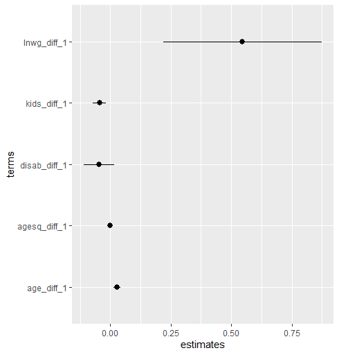
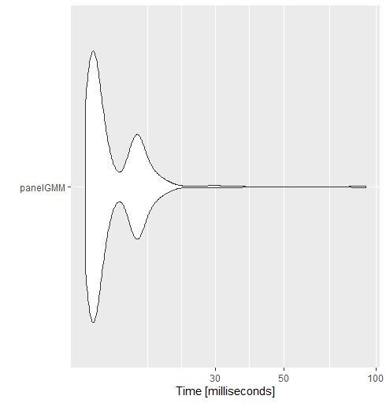

# panelGMM

General Method of Moments (GMM) estimators for panel data with lagged and differenced instruments in R. 

The function `panelGMM` estimates one-step and two-step GMM-IV linear models for panel data. Panel-robust standard errors are calculated using the algorithm laid out in Chapter 22 of Cameron and Trivedi (2005). 

The package also provides convenience functions to lag/lead/difference variables (`panelGMM::shiftCols`) and to convert the `panelGMM` object (the estimated parameters and hypothesis tests) into a data.frame (`panelGMM::tidy_panelGMM`). This is similar to `broom::tidy`.

## Algorithm


## Installation

```R
library("devtools")
install_github("lrdegeest/panelGMM")
```

## Demo

Recreate the base-case two-step GMM-IV model in Table 22.2 of Cameron and Trivedi (2005). The authors estimate wages for a panel of 532 workers from 1981 - 1988. 

```R
library(panelGMM)
library(tidyverse) # for the pipe (%>%) and ggplot2

# load the data
data("hours_wages")

# use panelGMM::shiftCols to create lags and differences with automatic names
hours_wages_gmm = hours_wages %>%
  shiftCols(data = ., panel=id, type = "difference", shifts = 1:2, columns=c("lnhr", "lnwg", "kids", "age", "agesq", "disab")) %>%
  shiftCols(data = ., panel=id, type = "lag", shifts = 1:2, columns=c("lnhr", "lnwg", "kids", "age", "agesq", "disab"))

# define the model
model = lnhr_diff_1 ~ lnwg_diff_1 + kids_diff_1 + age_diff_1 + agesq_diff_1 + disab_diff_1 | kids_lag_1 + kids_lag_2 + age_lag_1 + age_lag_2 + agesq_lag_1 + agesq_lag_2 + disab_lag_1 + disab_lag_2 + lnwg_lag_2

# estimate the parameters and view the summary
panelGMM(model, panel = id, time = year, twostep = TRUE, data = hours_wages_gmm) %>% 
  summary()


-------------------------------------------------------------------
CALL
panelGMM(formula = model, panel = id, time = year, twostep = TRUE, 
    data = hours_wages_gmm)


-------------------------------------------------------------------
MODEL DETAILS

  Unique cross-sections (N):  532
  Unique obs. per cross-section (T):  8
  Total number of obs. (N x T):  4256
  Number of instruments:  9

-------------------------------------------------------------------
COEFFICIENTS
               Estimate  Std.Error z-value Pr(>|z|)  
lnwg_diff_1   0.5467961  0.3276239   1.669   0.0951 .
kids_diff_1  -0.0449042  0.0271441  -1.654   0.0981 .
age_diff_1    0.0274759  0.0129598   2.120   0.0340 *
agesq_diff_1 -0.0003591  0.0001594  -2.253   0.0243 *
disab_diff_1 -0.0468348  0.0623601  -0.751   0.4526  
---
Signif. codes:  0 ‘***’ 0.001 ‘**’ 0.01 ‘*’ 0.05 ‘.’ 0.1 ‘ ’ 1


-------------------------------------------------------------------
MODEL SUMMARY

Root mean square error (RMSE): 0.307

Overidentification Restrictions Test (OIR)
   J-statistic: 5.4504,  p-value: 0.2441,  DOF (r - k) = 4

```

`panelGMM` is not yet set up to work with `broom` or `sjPLot`. But you can use `panelGMM::tidy_panelGMM` to convert the estimated model to a `data.frame` and pipe the output to `ggplot`:

```R
panelGMM(model, panel = id, time = year, twostep = TRUE, data = hours_wages_gmm) %>% 
  tidy_panelGMM() %>% 
  ggplot(., aes(x = terms, y = estimates)) +
  geom_point() +
  geom_pointrange(aes(ymin = estimates -standard.errors, ymax = estimates + standard.errors)) +
  coord_flip()
```



## Speed

Several core routines in `panelGMM` are written in C++ so estimation is pretty fast:

```R
microbenchmark::microbenchmark(
  "panelGMM" = panelGMM(model, panel = id, time = year, twostep = TRUE, data = hours_wages_gmm),
  times = 1000) %>% 
  ggplot2::autoplot(.)
```



## References

Cameron, A. Colin, and Douglas L. Miller. "A practitioner’s guide to cluster-robust inference." Journal of human resources 50, no. 2 (2015): 317-372.

Cameron, A. Colin, and Pravin K. Trivedi. Microeconometrics: Methods and Applications. Cambridge university press, 2005.